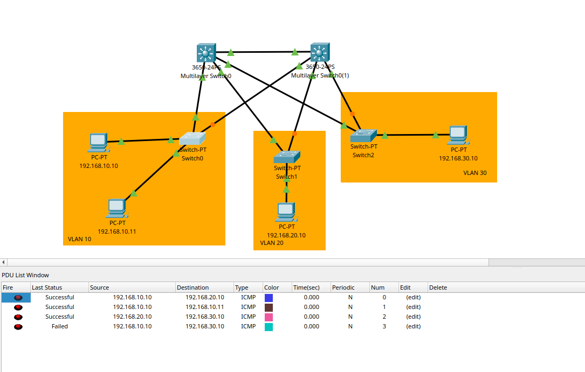

# TASK1 - VLAN


- Kết nối giữa các PC cùng VLAN.
- Kết nối giữa các PC khác VLAN.
- dùng ACL để chặn 2 VLAN với nhau

| 📂 Tài liệu                | Nội dung chính                                                                 |
|----------------------------|--------------------------------------------------------------------------------|
| [⚙️ Workflow](./document/VLAN.md)         | MỤC TIÊU Tạo 3 VLAN (VLAN10, VLAN20, VLAN30) |
| [⚙️ design](./design.png)         | MỤC TIÊU thiết kế |


```C++
| PC  | VLAN | IP Address    | Default Gateway |
| --- | ---- | ------------- | --------------- |
| PC1 | 10   | 192.168.10.10 | 192.168.10.1    |
| PC2 | 10   | 192.168.10.11 | 192.168.10.1    |
| PC3 | 20   | 192.168.20.10 | 192.168.20.1    |
| PC4 | 30   | 192.168.30.10 | 192.168.30.1    |
-------------------------------------------------------------
# Gửi Tin nhắn
|         | PC1(V10) | PC2(V10) | PC3(V20) | PC4(V30) |
| ------- | -------- | -------- | -------- | -------- |
| PC1     | -        | ✔        | ✔        | ✖        |
| PC2     | ✔        | -        | ✔        | ✖        |
| PC3     | ✔        | ✔        | -        | ✔        |
| PC4     | ✖        | ✖        | ✔        | -        |
```



---
<p align="center">
  <a href="https://www.facebook.com/Shiba.Vo.Tien">
    
  </a>
  <a href="https://www.tiktok.com/@votien_shiba">
    
  </a>
  <a href="https://www.facebook.com/groups/khmt.ktmt.cse.bku?locale=vi_VN">
    
  </a>
  <a href="https://www.facebook.com/CODE.MT.BK">
    
  </a>
  <a href="https://github.com/VoTienBKU">
    
  </a>
</p>