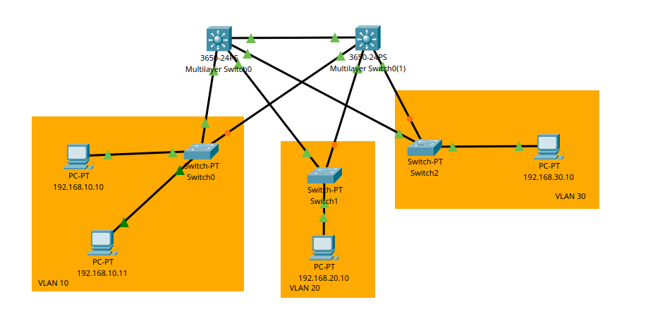
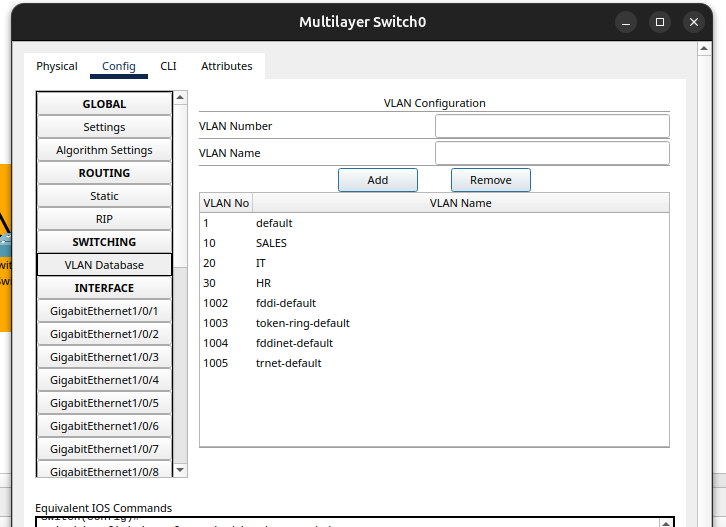
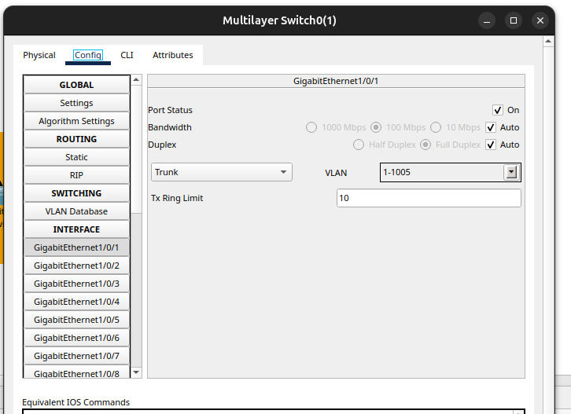
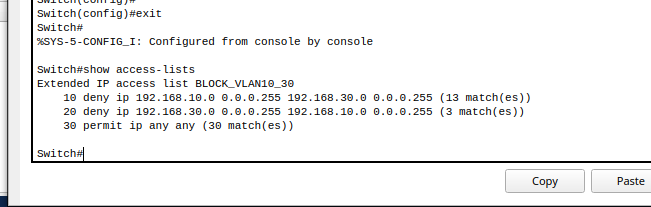
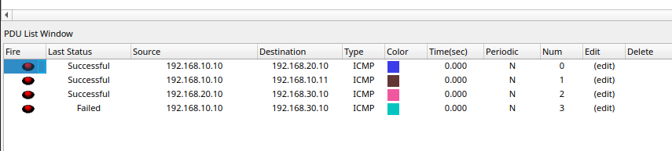

# 🧩 MỤC TIÊU Tạo 3 VLAN (VLAN10, VLAN20, VLAN30)

* **2 Switch Layer 3 (Cisco 3650) – Switch tầng phân phối (Distribution)**
* **3 Switch thường (Switch PT 2960) – Switch tầng truy cập (Access)**
* **3 PC**, mỗi PC thuộc một VLAN khác nhau.

---

# 📘 LÝ THUYẾT

## VLAN

**VLAN (Virtual Local Area Network)** là một kỹ thuật cho phép chia một mạng vật lý thành nhiều mạng logic riêng biệt.

- Các thiết bị trong cùng VLAN có thể giao tiếp trực tiếp với nhau.
- Các thiết bị khác VLAN muốn giao tiếp phải thông qua thiết bị định tuyến (router hoặc switch Layer 3)

## Các loại port trong VLAN

- Access Port Chỉ thuộc 1 VLAN duy nhất, dùng để kết nối với thiết bị đầu cuối (PC, laptop, camera…)
```
switchport mode access
switchport access vlan 10
```

- Trunk Port Cho phép nhiều VLAN đi qua cùng lúc, dùng để kết nối giữa các switch hoặc switch với router
```
switchport mode trunk
switchport trunk allowed vlan 10,20,30
```

## KIến thức khác

- ACL (Access Control List): Kiểm soát lưu lượng giữa các VLAN, Cho phép hoặc chặn truy cập theo IP

- Default Gateway: Là địa chỉ để thiết bị gửi dữ liệu ra ngoài mạng của nó.

- Inter-VLAN Routing (Định tuyến giữa các VLAN): Vì các VLAN bị tách biệt, nên muốn các VLAN giao tiếp với nhau cần có thiết bị Layer 3.


# 🖧  SƠ ĐỒ KẾT NỐI

* **Các switch access** nối lên switch 3650 bằng **cổng trunk**.
* **PC** nối vào switch access bằng **cổng access**.
* Switch 3650 định tuyến giữa các VLAN.



## 🔸 Trên các PC

Gán IP theo VLAN:

| PC  | VLAN | IP Address    | Default Gateway |
| --- | ---- | ------------- | --------------- |
| PC1 | 10   | 192.168.10.10 | 192.168.10.1    |
| PC2 | 10   | 192.168.10.11 | 192.168.10.1    |
| PC3 | 20   | 192.168.20.10 | 192.168.20.1    |
| PC4 | 30   | 192.168.30.10 | 192.168.30.1    |

---

# ⚙️ CẤU HÌNH CHI TIẾT

## Trên Switch Layer 3 (3650)

### a. Tạo VLAN và SVI (định tuyến nội bộ)

```bash
enable
configure terminal

vlan 10
 name SALES
vlan 20
 name IT
vlan 30
 name HR
exit

interface vlan 10
 ip address 192.168.10.1 255.255.255.0
 no shutdown

interface vlan 20
 ip address 192.168.20.1 255.255.255.0
 no shutdown

interface vlan 30
 ip address 192.168.30.1 255.255.255.0
 no shutdown

! Bật tính năng định tuyến
ip routing
```



### b. Cấu hình các cổng trunk nối xuống Access Switch

```bash
interface range gi0/1 - 3
 switchport mode trunk
 switchport trunk allowed vlan 10,20,30
 no shutdown
exit
```



### c. ACL (Access Control List)

```bash
ip access-list extended BLOCK_VLAN10_30
 ! Chặn VLAN10 đến VLAN30
 deny ip 192.168.10.0 0.0.0.255 192.168.30.0 0.0.0.255
 ! Chặn VLAN30 đến VLAN10
 deny ip 192.168.30.0 0.0.0.255 192.168.10.0 0.0.0.255
 ! Cho phép tất cả lưu lượng khác
 permit ip any any

interface vlan 10
 ip access-group BLOCK_VLAN10_30 out
exit

interface vlan 30
 ip access-group BLOCK_VLAN10_30 out
exit
```



---

## Trên từng Switch PT (Access Layer)

### a. Tạo VLAN tương ứng

```bash
enable
configure terminal
vlan 10
 name SALES
vlan 20
 name IT
vlan 30
 name HR
exit
```

### b. Cấu hình port kết nối với PC (Access port)

- Cổng nối giữa các switch multilayer → cấu hình Trunk port để truyền nhiều VLAN.
    - Trunk port: cho phép nhiều VLAN đi qua.
- Cổng nối trực tiếp tới PC → cấu hình Access port, gán VLAN tương ứng cho PC.
    - Access port: chỉ gán 1 VLAN cho thiết bị cuối (PC, camera…).

---

## Result

